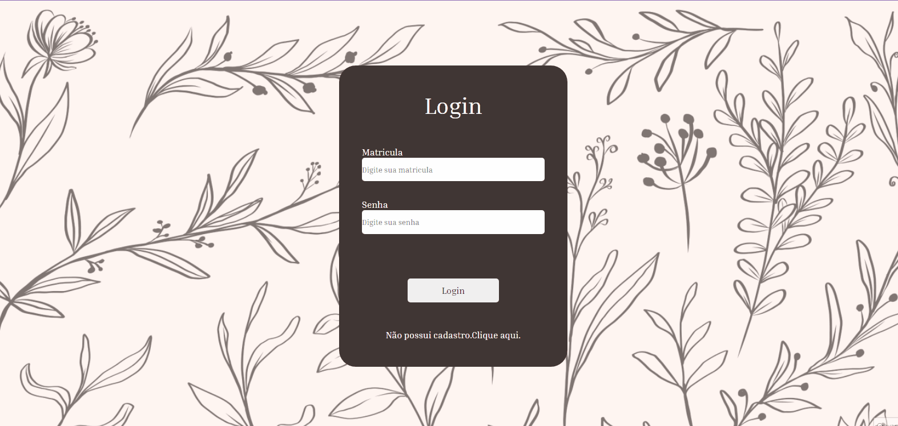

# Coffee Bar

Cafeteria menu system for waiters use to reduce paper usage in commercial establishments and this design can be changed for different establishments not just coffee shops.

 

# Summary
* [Tecnologies](#tecnologies)
* [Functionality](#functionality)
* [How to start](#how-to-start) 

 # Tecnologies

For the icons, the React icons installed through the terminal were used

    npm install react-icons --save

The routes were created using the react router installed by the terminal

    npm install react-router-dom

# Functionality

[ ] Register employee
    
- Full name
- Enrollment
- Employee check-in and check-out
- Email
- Password

[ ] Employee login

- Enrollment
- Password

[ ] Password change

- Enrollment
- New password

[ ] Registration authorization by the manager

- Manager Enrollment
- Manager password

[ ] Generate table order

- Table number
- Check-in
- Dishes
    - Hot
    - Cold
    - Side dish

[ ] Employee perfil

- Full name
- Enrollment
- Work schendule
- Email
- Employee profile image
# How to start

To start the project in react it is necessary to run the command in your terminal in the repository where your project is. 

>**Obs:** For this you need to have NODE(LTS) installed on your computer.
https://nodejs.org/en/

    npm install
And after this.

    npm start

If the page does not open automatically, it can be accessed by the urls

    Local: http://localhost:3000
    On Your Network: http://192.168.100.120:3000